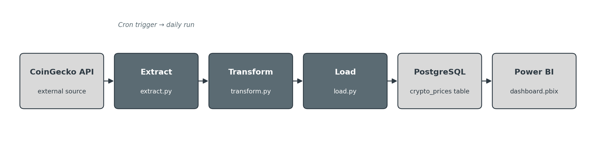
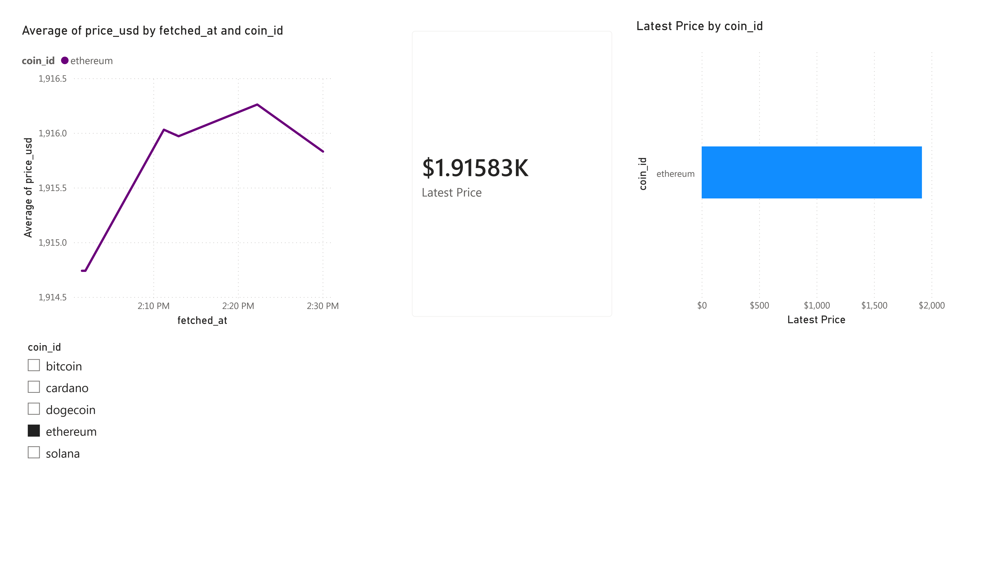

# Crypto ETL Pipeline with Power BI Dashboard

An automated, tested ETL pipeline that extracts live cryptocurrency prices via the
CoinGecko API, validates and transforms the data, loads it into PostgreSQL on a
daily cron schedule, and visualizes historical trends through a Power BI dashboard.

## Dashboard

## Stack
Python 3.11 · PostgreSQL (Docker) · pytest · GitHub Actions · cron · Power BI

## Setup
1. `docker compose up -d`
2. `python3 -m venv venv && source venv/bin/activate`
3. `pip install -r requirements.txt`
4. Copy `.env.example` to `.env` and fill in your values
5. `docker exec -i crypto_postgres psql -U crypto_user -d crypto_db < schema.sql`
6. `python main.py`

## Testing
`python -m pytest -v` — unit tests cover the transform/validation logic in isolation,
no database or network required.

## Monitoring & known limitation
The cron job pings [healthchecks.io](https://healthchecks.io) on success, so a
silent failure triggers an email alert. One honest caveat: cron only runs while
WSL2 is active — if the machine's been off, the schedule pauses. That gap is
exactly what the healthchecks.io alert is designed to catch.

## Future improvements
- Wrap `main.py` in an Airflow DAG for orchestration-level retries and logging
- Move Postgres to a cloud instance and switch Power BI to DirectQuery
- Slack webhook alerting alongside healthchecks.io
